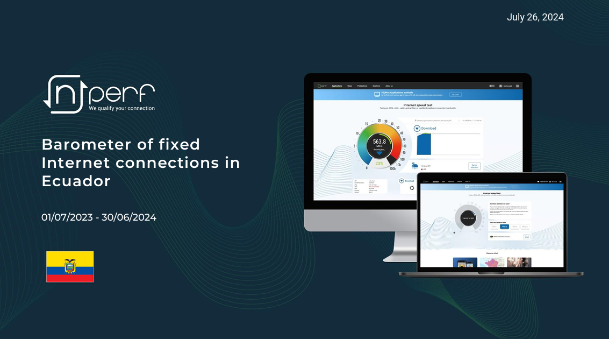
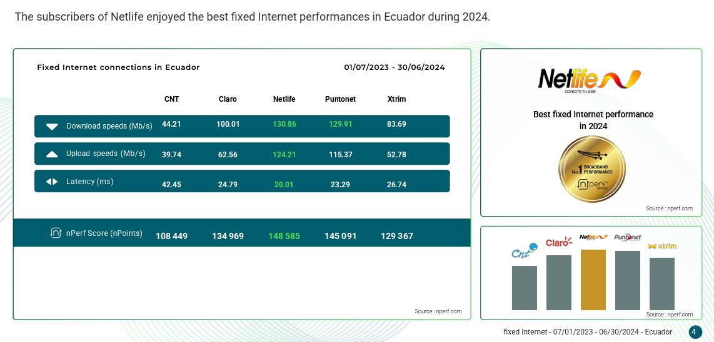
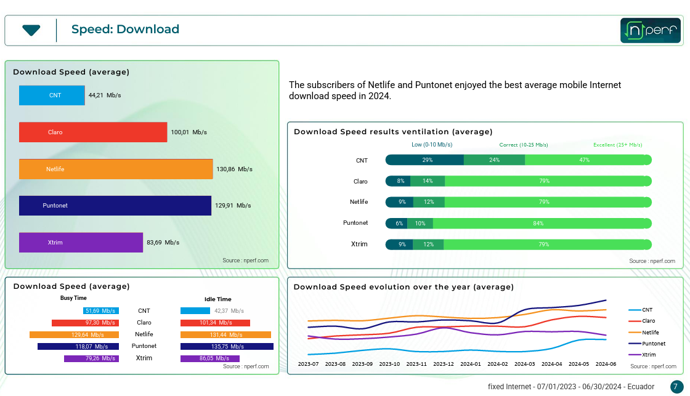

# Módulo 1: Fundamentos de Redes de Datos
### MSc. Carlos Cedeño

## Aclarando dudas sobre tu ISP

---

# ¿Qué es un ISP?
Un ISP (Proveedor de Servicios de Internet, por sus siglas en inglés Internet Service Provider) es una empresa que proporciona acceso a internet tanto a personas como a organizaciones. Estos ISP permiten a los usuarios conectarse a la red a través de diferentes tecnologías, como ADSL, cable o fibra óptica. 

---

# Análisis de un estudio externo: NPERF

---

---

%

---

---

### Los ISPs deben respetar los SLA!!

######  (Y Uds. deben estar al tanto para validar el servicio)

---

## Aspectos a tener en cuenta

* Compartición (usualmente 2:1)
* Obsolescencia de equipos
* Repetidores VS Mesh
   